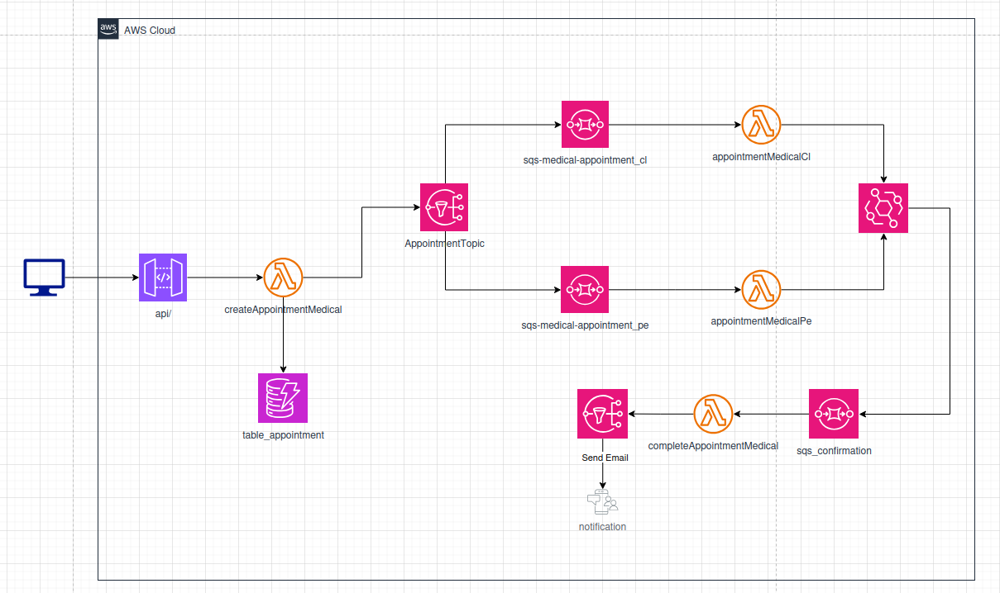

# Medical Appointment Scheduling — Backend AWS
 
Aplicación backend para el agendamiento de citas médicas de asegurados que residen en Perú como en Colombia.

## Diseño de Arquitecura Cloud


 
## Instalación y Despliegue
 
### Prerrequisitos
 
- Node.js >= 22.x
- AWS CLI 
- Serverless Framework v3 
### 1. Clonar e instalar dependencias
 
```bash
git clone https://github.com/tu-org/medical-appointment-backend.git
cd medical-appointment-backend
npm install
```
 
### 2. Compilar TypeScript
 
```bash
npm run build
```
 
### 3. Ejecutar pruebas
 
```bash
npm test
```
 
### 4. Configurar credenciales AWS
 
```bash
aws configure
```
 
 ### 5. Desplegar el proyecto
 
```bash
npx sls deploy

en caso de eliminar:

npx sls remove
```


